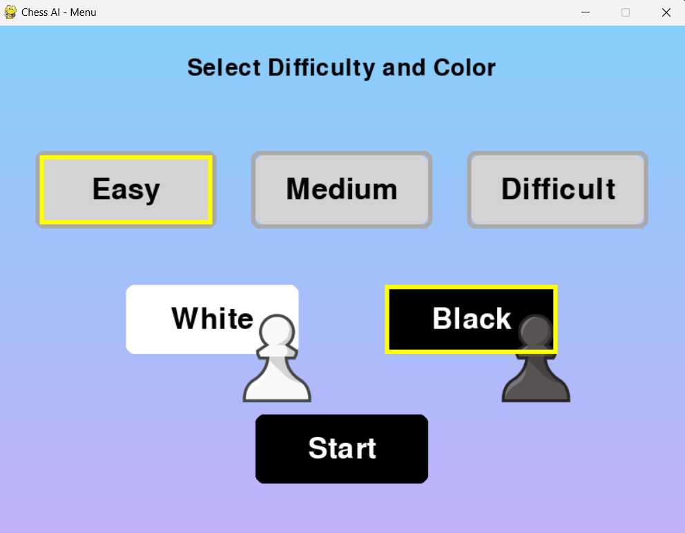
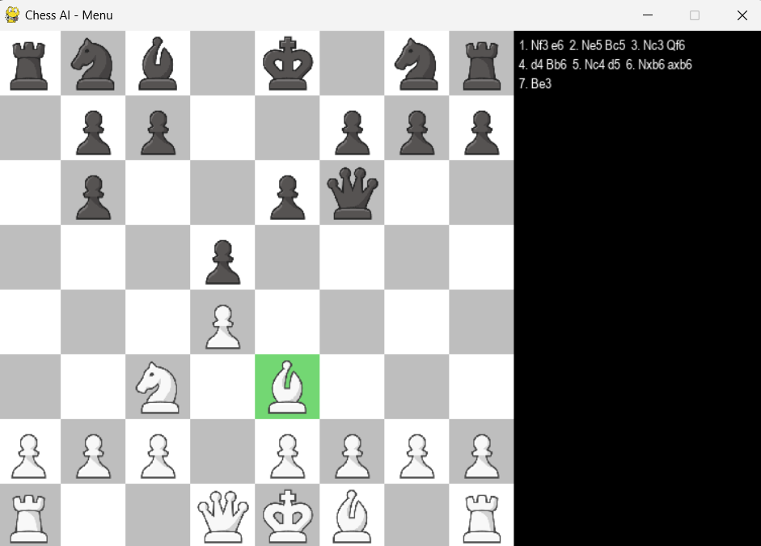
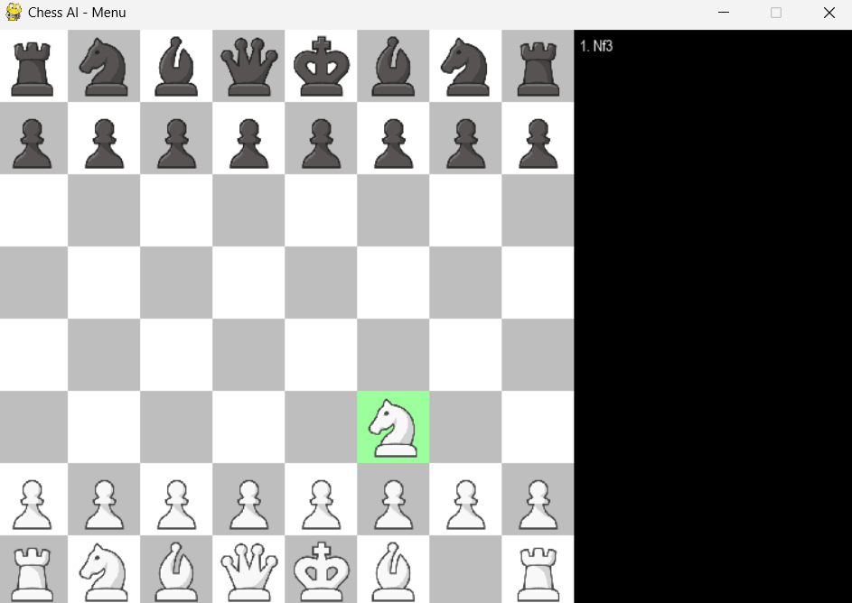
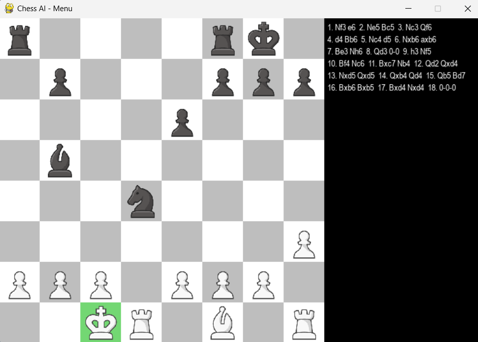
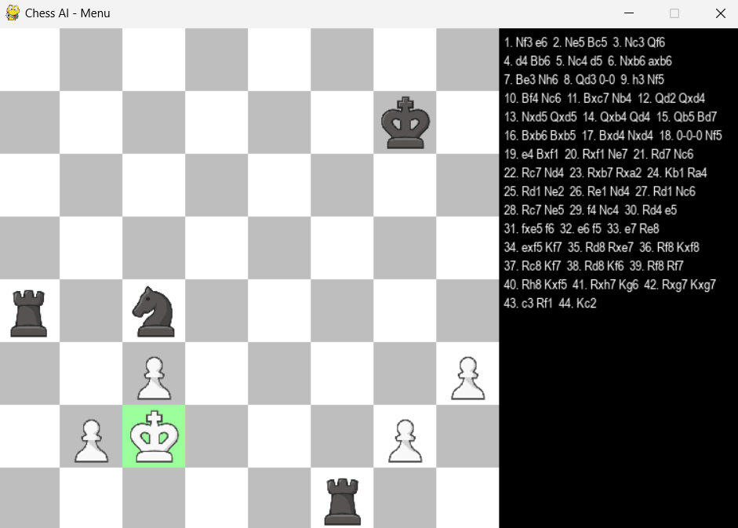
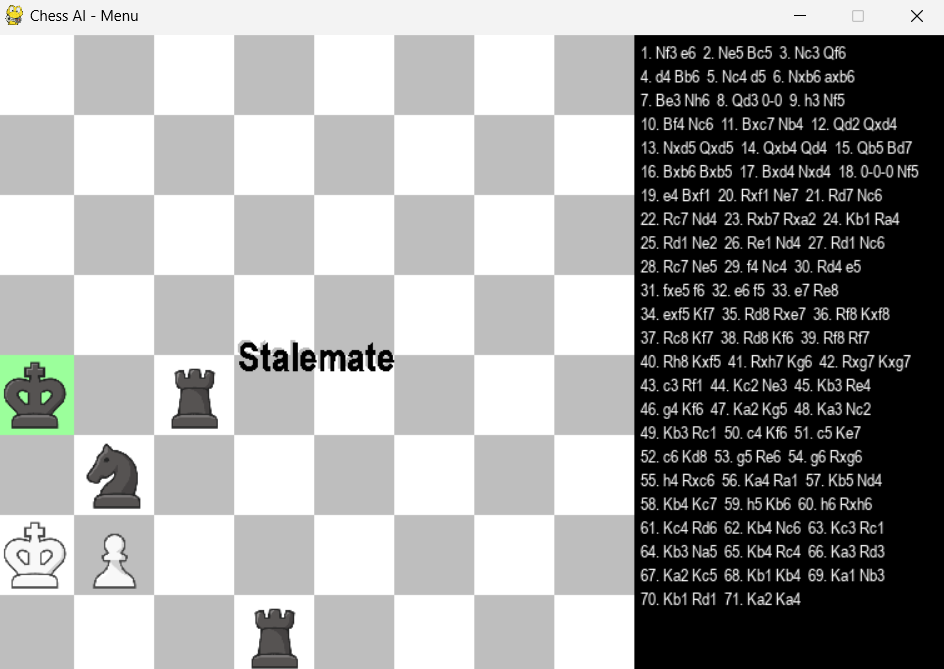

# ♟️ Chess AI Game 🎮

<div align="center">
  
  
  
</div>

---

Welcome to **Chess AI Game**, a Python-based chess game featuring an intelligent AI opponent, immersive sound effects, and a visually appealing interface. Whether you're a chess enthusiast or a beginner, this game promises to challenge and entertain you! 🎉

---

## ✨ Features
✔️ **AI-Powered Gameplay**:  
The game uses a sophisticated **Negamax algorithm with Alpha-Beta pruning**, ensuring competitive and strategic gameplay.

✔️ **Multiple Difficulty Levels**:  
Choose between Easy, Medium, and Hard modes to match your skill level.

✔️ **Immersive Visuals and Sounds**:  
Enjoy smooth animations, high-quality chess piece graphics, and sound effects for moves, captures, and pawn promotions.

✔️ **Standard Chess Rules**:  
Includes:
- Castling
- En passant
- Pawn promotion
- Stalemate and checkmate detection

✔️ **Interactive Menu**:  
Select your game settings, including difficulty and color, with a simple click.

---

## 📂 Project Structure
```plaintext
Chess-AI-Game/
├── ChessEngine.py       # Handles core game logic and rules
├── AI_Algo.py           # Implements AI algorithms (Negamax with Alpha-Beta Pruning)
├── Main.py              # Main script to run the game with the Pygame interface
├── images/              # Folder containing chess piece images
│   ├── bB.PNG           # Black Bishop
│   ├── bK.PNG           # Black King
│   ├── bN.PNG           # Black Knight
│   ├── bP.PNG           # Black Pawn
│   ├── bQ.PNG           # Black Queen
│   ├── bR.PNG           # Black Rook
│   ├── wB.PNG           # White Bishop
│   ├── wK.PNG           # White King
│   ├── wN.PNG           # White Knight
│   ├── wP.PNG           # White Pawn
│   ├── wQ.PNG           # White Queen
│   ├── wR.PNG           # White Rook
├── sounds/              # Folder containing sound effects
│   ├── move.mp3         # Sound effect for a regular move
│   ├── capture.mp3      # Sound effect for capturing a piece
│   ├── promote.mp3      # Sound effect for pawn promotion
├── README.md            # Project documentation
├── requirements.txt     # Python dependencies (e.g., Pygame)
```
---

## 🛠️ Installation

Follow these simple steps to get started:

---

### Step 1: Clone the Repository
git clone https://github.com/W4RG0Dpk/Chess-AI-Game.git
cd Chess-AI-Game

---

### Step 2: Install Dependencies
Make sure you have Python 3.8+ installed, then install the required packages:
pip install -r requirements.txt

---

### Step 3: Run the Game
Start the chess game by running:
python Main.py

---

## 🎮 How to Play
Launch the Game:


Select the difficulty level (Easy, Medium, Hard).
Choose your color (White or Black).
Move Your Pieces:


Click on a piece to see valid moves highlighted on the board.
Click on a valid destination to move the piece.
Special Controls:

Press Z to undo the last move.
Press R to restart the game.

## 🎨 Screenshots

### Main Menu
The main menu allows you to select difficulty levels and choose your color:


### Game Interface
The game interface features a chessboard with move highlights and intuitive controls:


### Game logs and Stalemate demo





---

## 🤖 How the AI Works
The AI uses the Negamax algorithm with Alpha-Beta pruning to search for optimal moves:

Negamax: Simplifies decision-making by flipping scores for the opponent's perspective.

Alpha-Beta Pruning: Optimizes the search by cutting off branches that cannot influence the outcome.

---

## 💻 Tech Stack

Python: Core language for implementation.

Pygame: For graphical interface and animations.

Multiprocessing: To manage AI computations efficiently

---

## 🔊 Credits

Pygame: For providing an easy-to-use library for graphics and sound.

Freepik: Source of chess piece images.

Zapsplat: Source of sound effects.

---

## 🌟 Connect
Follow me on GitHub for more projects like this! 😄 
Or
you can contact me on instagram: pavankrishna_v

